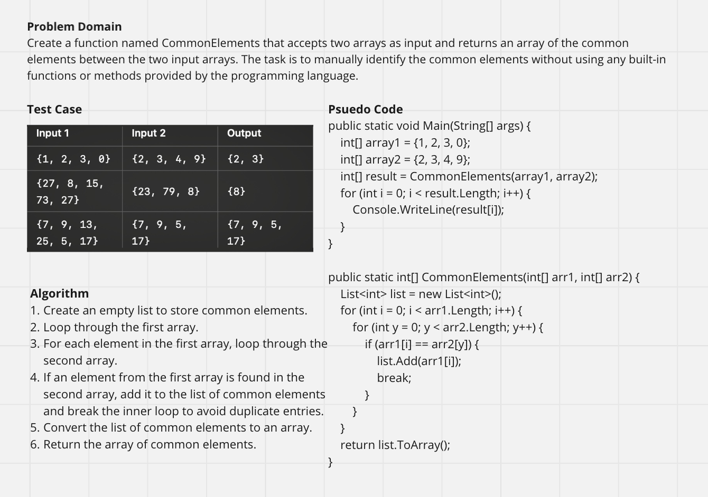

## Overview

The Common Elements Challenge is a programming exercise designed to identify and return common elements between two integer arrays. This challenge provides an opportunity to practice using arrays, lists, loops, and basic unit testing in C#. The project includes a C# console application and unit tests written using xUnit.

## Project Structure

The project is organized into two main parts:

1. Common_Elements: The main console application.
2.	Common_Elements.Tests: The unit test project using xUnit.

## WhiteBoard
