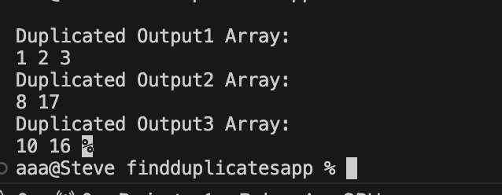

# FindDuplicates Challenge

## Challenge Description

The challenge is to write a function called `FindDuplicates` that accepts an array as its parameter. Without utilizing any of the built-in methods provided by the language, the function should return an array of duplicate values.

### Example

- **Input**: `[1, 2, 3, 1, 2, 3]`
  - **Output**: `[1, 2, 3]`

- **Input**: `[16, 8, 31, 17, 15, 23, 17, 8]`
  - **Output**: `[17, 8]`

- **Input**: `[5, 10, 16, 20, 10, 16]`
  - **Output**: `[10, 16]`

## Console Result

Below is the Console image with the Result of running:

