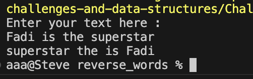

# Overview
The Reversing Words Console Application is a simple command-line tool designed to take a string of words as input and return the string with the words in reverse order.

## Features
* Accepts a sentence as input from the console.
* Outputs the sentence with the words in reverse order.

## Screenshot 
